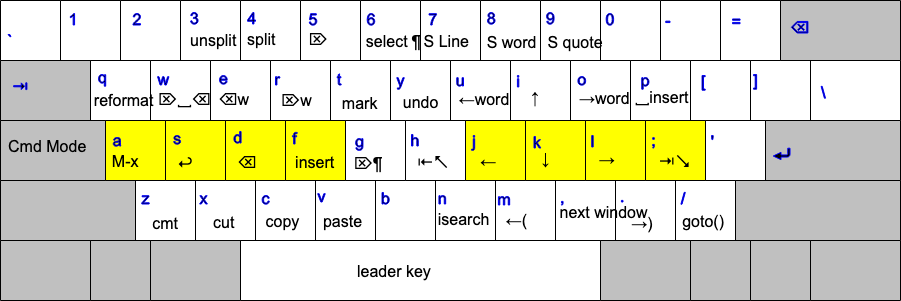

xah-fly-keys
===================

A modal keybinding for emacs (like vim), but based on command frequency and ergonomics.

This is the most efficient editing system in the universe.

home page at
http://ergoemacs.org/misc/ergoemacs_vi_mode.html

2020-04-18 News: Key Engine Rewrite
===================

Major key engine rewrite by Dan Langlois (https://github.com/DanLanglois) and Will Dey (https://github.com/wi11dey) .

QWERTY layout
-------------------


Manual Install
-------------------

put the file xah-fly-keys.el in ~/.emacs.d/lisp/
create the dir if doesn't exist.

put the following in your emacs init file:

```elisp
(add-to-list 'load-path "~/.emacs.d/lisp/")
(require 'xah-fly-keys)
(xah-fly-keys-set-layout "qwerty") ; required
```

The following keyboard layouts are supported:

* adnw
* azerty
* azerty-be
* beopy
* bepo
* carpalx-qfmlwy
* carpalx-qgmlwb
* carpalx-qgmlwy
* colemak
* colemak-mod-dh
* colemak-mod-dh-new
* dvorak
* koy
* neo2
* norman
* programer-dvorak
* pt-nativo
* qwerty
* qwerty-abnt
* qwerty-no (qwerty Norwegian)
* qwertz
* workman

Full Documentation
-------------------

http://ergoemacs.org/misc/ergoemacs_vi_mode.html

Been working on this since 2013, and since 2007 on ergoemacs-mode.

Put in 5 bucks in my patreon.
https://www.patreon.com/xahlee

or https://paypal.com
pay to xah@xahlee.org

Thanks.
