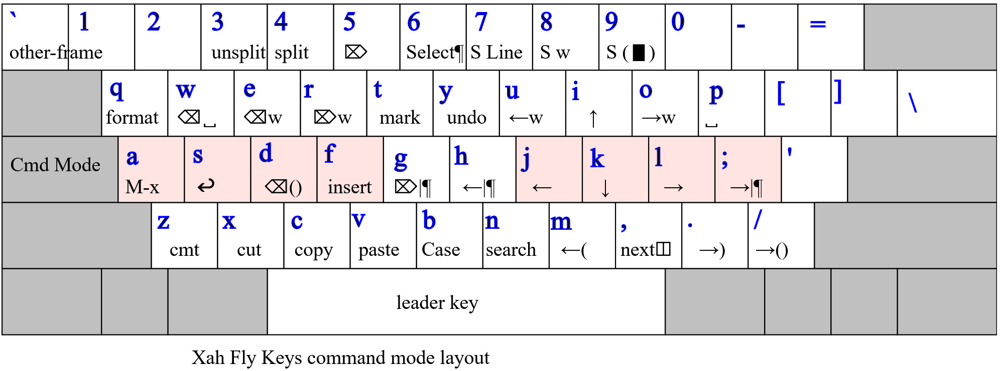

xah-fly-keys
===================

A modal keybinding for emacs (like vim), but based on command frequency and ergonomics.

This is the most efficient editing system in the universe.

Xah Fly Keys home page at
http://xahlee.info/emacs/misc/xah-fly-keys.html

2020-04-18 News: Key Engine Rewrite
===================

Major key engine rewrite by Dan Langlois (https://github.com/DanLanglois) and Will Dey (https://github.com/wi11dey) .

QWERTY layout
-------------------


Manual Install
-------------------

put the file xah-fly-keys.el in ~/.emacs.d/lisp/
create the dir if doesn't exist.

put the following in your emacs init file:

```elisp

(add-to-list 'load-path "~/.emacs.d/lisp/")

(require 'xah-fly-keys)

;; specify a layout
(xah-fly-keys-set-layout "qwerty")

;; possible values
;; adnw (German), azerty, azerty-be, bepo (French), colemak, colemak-dh, dvorak, engrammer, halmak, koy (German), minimak, neo2 (German), norman, programer-dvorak, pt-nativo (Brazil), qfmlwy, qgmlwb, qwerty, qwerty-abnt (Brazil), qwerty-no (Norwegian), qwerty-se (Swedish), qwertz, qwpr, russian, workman

(xah-fly-keys 1)
```

Full Documentation
-------------------

http://xahlee.info/emacs/misc/xah-fly-keys.html

Been working on this since 2013, and since 2007 on ergoemacs-mode.

give me 5 bucks https://paypal.com pay to Xah@XahLee.org

Thanks.
