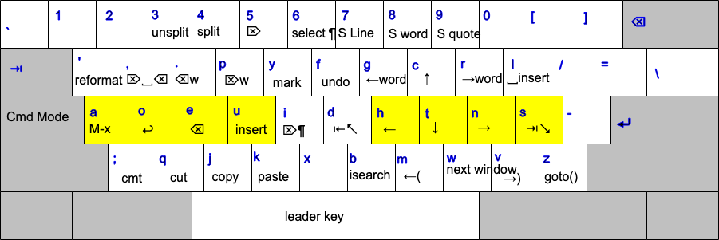

xah-fly-keys
===================

A modal keybinding for emacs (like vim), but based on command frequency and ergonomics.

This is the most efficient editing system in the universe.

home page at
http://ergoemacs.org/misc/ergoemacs_vi_mode.html

2020-04-18 News: Key Engine Rewrite
===================

Major key engine rewrite by Dan Langlois (https://github.com/DanLanglois) and Will Dey (https://github.com/wi11dey) . Much doc update will happen in next few days, on how to customize and how the new code works, at xah fly keys home page http://ergoemacs.org/misc/ergoemacs_vi_mode.html

The old stable version is available at
http://ergoemacs.org/misc/i/xah-fly-keys_old_2020-04-18.el

QWERTY layout
-------------------


DVORAK layout
-------------------


Neo2 layout
-------------------


Setup
-------------------
Add the following to `.emacs` after installing manually or via MELPA:
```elisp
(require 'xah-fly-keys)
(xah-fly-keys-set-layout "qwerty") ; required
```

The following keyboard layouts are supported:

* "azerty"
* "azerty-be"
* "colemak"
* "colemak-mod-dh"
* "dvorak"
* "programer-dvorak"
* "qwerty"
* "qwerty-abnt"
* "qwertz"
* "workman"
* "norman"
* ["neo2"](https://neo-layout.org/) 

Customization
-------------------
If you want to add keybindings to command-mode, add bindings to `xah-fly-command-map`.
Similarly, to add keybindings to insert-mode, add bindings to `xah-fly-insert-map`.

In case you want to add bindings available in both command- and insert-mode,
define them in `xah-fly-shared-map`, which is the parent that both `xah-fly-command-map`
and `xah-fly-insert-map`.

Define these bindings as follows:

```elisp
(with-eval-after-load 'xah-fly-keys
  ;; Command mode keybindings:
  (define-key xah-fly-command-map (kbd "KEY") #'DEFINITION)

  ;; Insert mode keybindings:
  (define-key xah-fly-insert-map (kbd "KEY") #'DEFINITION))
```

*N.B.* For backward compatibility, `xah-fly-key-map` points to `xah-fly-command-map`
in command-mode and to `xah-fly-insert-map` in insert-mode, which means
if you already have code like this in your config, it will continue to
work:

```elisp
(defun my-xfk-addon-command ()
  "Modify keys for xah fly key command mode keys
To be added to `xah-fly-command-mode-activate-hook'"
  (interactive)
  (define-key xah-fly-key-map (kbd "1") 'my-command-abc)
  ;; more here
  )

(add-hook 'xah-fly-command-mode-activate-hook 'my-xfk-addon-command)

(defun my-xfk-addon-insert ()
  "Modify keys for xah fly key command mode keys
To be added to `xah-fly-insert-mode-activate-hook'"
  (interactive)
  (define-key xah-fly-key-map (kbd "2") 'my-command-xyz)
  ;; more here
  )

(add-hook 'xah-fly-insert-mode-activate-hook 'my-xfk-addon-insert)
```

However, you should switch to defining bindings in either `xah-fly-command-map`
or `xah-fly-shared-map` since they are easier to debug for you, easier
to maintain for us, and define bindings only once rather than every mode
switch.

### Remapping
A very effective way to change what the command-mode keys do based on the
major/minor mode is [_command remapping_](https://www.gnu.org/software/emacs/manual/html_node/elisp/Remapping-Commands.html).
Command remapping will work no matter which keyboard layout you choose
to use, and allows you to make the customizations in the major/minor mode’s
map rather than the global `xah-fly-command-map`. Emacs automatically looks
up remappings after finding the command bound to a key. Xah Fly Keys defines
no command remappings, so they will always be looked up in the normal major
and minor mode maps.

To add a remapping, find the command that Xah Fly Keys binds to a key in
command mode (e.g. through `describe-key`), then add a binding in the major/minor
mode’s map like so:
```elisp
(define-key MAJOR-OR-MINOR-MODE-MAP [remap XAH-FLY-COMMAND-NAME] #'MODE-SPECIFIC-COMMAND-NAME)
```

For example, to make the `ijkl` keys scroll a PDF Tools page while in command
mode:
```elisp
(with-eval-after-load 'pdf-view
  (define-key pdf-view-mode-map [remap next-line] #'pdf-view-next-line-or-next-page)
  (define-key pdf-view-mode-map [remap previous-line] #'pdf-view-previous-line-or-previous-page))
```

---

Been working on this since 2013, and since 2007 on ergoemacs-mode.

Put in 5 bucks in my patreon.
https://www.patreon.com/xahlee

or https://paypal.com
pay to xah@xahlee.org

Thanks.
