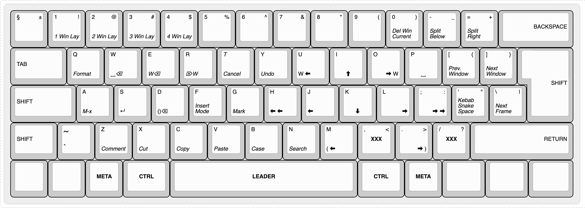

# xah-fly-keys

A modal keybinding minor mode for Emacs.


## Important note

This is my fork of [Xah Lee](https://github.com/xahlee)'s [repository](https://github.com/xahlee/xah-fly-keys). I forked it to tune this minor mode for my own use. If you are looking for specific functionality, I suggest that you either contribute to the original repository or create your own fork—either from the original or from this one if you prefer my modifications.


## Installation

1. Create the directory `~/.emacs.d/lisp/` if it doesn't exist.
2. Place `xah-fly-keys.el` in that directory.
3. Add the following to your Emacs init file:

```elisp
(add-to-list 'load-path "~/.emacs.d/lisp/")
(require 'xah-fly-keys)
(xah-fly-keys-set-layout "qwerty") ; Optional
(xah-fly-keys 1)
```

Available layouts:
- `"qwerty"`
- `"ukrainian"`

Available layouts are defined in the `xah-fly-layout-diagrams` variable.


## Documentation
You can find more information about this mode and detailed documentation on the [Xah Fly Keys home page](http://xahlee.info/emacs/misc/xah-fly-keys.html).


## Key diagram for ISO QWERTY keyboard layout



